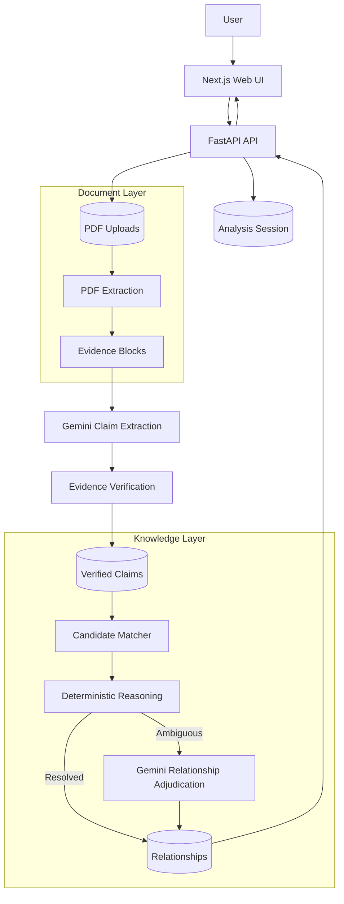
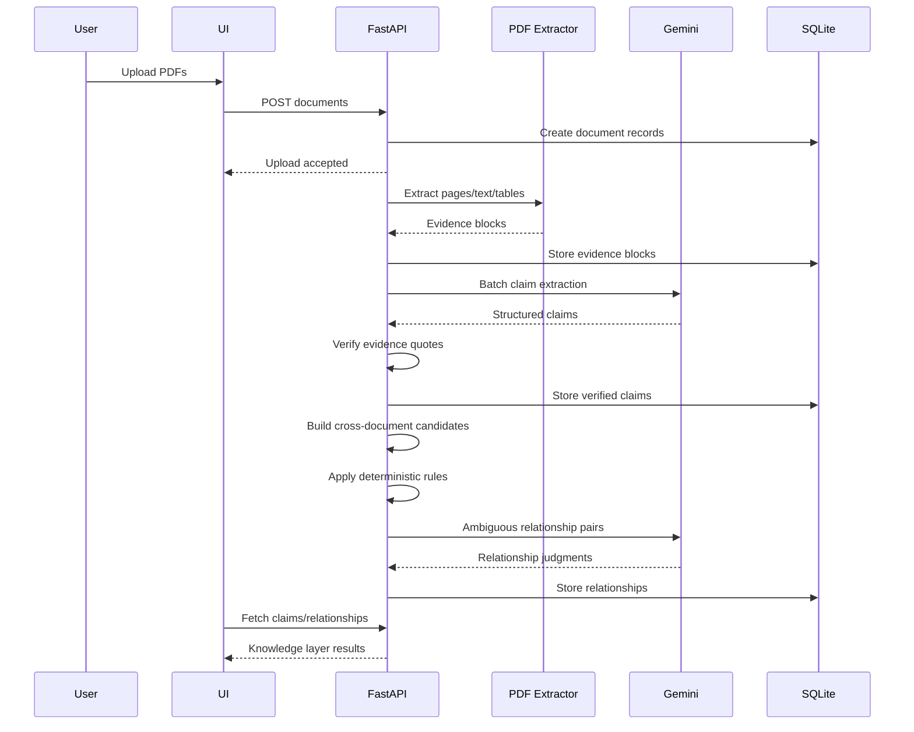

# Superjoin Fact Knowledge Layer

> **A document-grounded knowledge layer that extracts facts from PDFs, links every fact back to source evidence, and reasons across documents to identify corroboration, contradiction, and context-dependent differences.**

[](https://www.python.org/)
[](https://fastapi.tiangolo.com/)
[](https://ai.google.dev/)
[](https://www.sqlite.org/)
[](https://nextjs.org/)

**Engineering Intern Hiring Assignment · Superjoin VIT 2026**

---

## Table of Contents

- [Overview](#overview)
- [Why This Approach](#why-this-approach)
- [What the System Does](#what-the-system-does)
- [Architecture](#architecture)
- [Core Data Flow](#core-data-flow)
- [Fact Representation](#fact-representation)
- [Evidence Grounding](#evidence-grounding)
- [Cross-Document Reasoning](#cross-document-reasoning)
- [Relationship Types](#relationship-types)
- [Deterministic + LLM Reasoning](#deterministic--llm-reasoning)
- [Batch Processing and Incremental Updates](#batch-processing-and-incremental-updates)
- [Project Structure](#project-structure)
- [Tech Stack](#tech-stack)
- [Setup](#setup)
- [Running the Application](#running-the-application)
- [Using the API](#using-the-api)
- [Using the UI](#using-the-ui)
- [Demo Video](#demo-video)
- [Required Case Demonstrations](#required-case-demonstrations)
- [Example Output](#example-output)
- [Engineering Decisions and Trade-offs](#engineering-decisions-and-trade-offs)
- [Failure Handling](#failure-handling)
- [Security and Configuration](#security-and-configuration)
- [Performance Considerations](#performance-considerations)
- [Limitations](#limitations)
- [Next Steps](#next-steps)
- [Evaluation Checklist](#evaluation-checklist)
- [Additional Notes](#additional-notes)
- [License](#license)

---

## Overview

Important facts rarely live in one perfectly structured source.

The same fact can appear:

- in different documents;
- with different wording;
- in different units;
- for different reporting periods;
- under different scopes;
- with different definitions or bases;
- or with values that genuinely disagree.

This project implements a **Fact Knowledge Layer** for PDFs.

The system turns unstructured documents into a grounded graph of claims:

```text
PDFs
  ↓
Evidence Blocks
  ↓
Extracted Claims
  ↓
Evidence Verification
  ↓
Candidate Matching
  ↓
Deterministic Comparison
  ↓
LLM Adjudication for Ambiguous Cases
  ↓
Cross-Document Relationships
```

The key design principle is:

> **A relationship is useful only when the underlying facts can be traced back to source evidence and the reasoning behind the relationship can be explained.**

The assignment explicitly asks for meaningful numerical/semantic facts, source evidence, and cross-document relationships including corroboration, contradiction, and context-based reconciliation. fileciteturn6file0L10-L23

---

## Why This Approach

A graph visualization by itself does not solve the problem.

The difficult part is deciding:

1. **What is a fact?**
2. **Where did the fact come from?**
3. **Which facts are actually comparable?**
4. **Are different values contradictory, or simply different because of context?**
5. **When should an LLM make the decision?**
6. **How can the result be inspected and explained?**

This implementation therefore separates the pipeline into explicit stages.

### Design goals

- **Grounded** — every extracted claim retains document/page/evidence information.
- **Generalizable** — no hard-coded facts or filenames from the starter PDFs.
- **Explainable** — relationships include a type, reason, explanation, and confidence.
- **Conservative** — candidate generation is intentionally narrower than unrestricted pairwise comparison.
- **Hybrid** — deterministic rules handle obvious cases; Gemini handles semantic ambiguity.
- **Incremental** — new documents can be added without rebuilding the entire knowledge layer.
- **Inspectable** — the system keeps enough intermediate information to debug extraction and reasoning failures.

The assignment also explicitly encourages solutions that generalize beyond the starter documents and handle ambiguity and uncertainty sensibly. fileciteturn6file0L37-L52

---

# What the System Does

## 1. Upload

Users upload one or more PDF documents into an isolated analysis session.

## 2. Extract evidence

The PDF extraction layer uses:

- **PyMuPDF** for page/text extraction;
- **pdfplumber** for table extraction.

Text is grouped into meaningful evidence blocks rather than sending every tiny PDF text fragment to the LLM.

Each evidence block contains:

```text
id
document_id
page
block_type
text
```

## 3. Extract claims

Gemini analyzes evidence blocks in batches and extracts structured claims.

A claim can contain concepts such as:

```text
subject
predicate
value
unit
value_type
period
scope
basis
definition
evidence_quote
```

The exact schema is intentionally application-defined rather than tied to the starter PDFs.

## 4. Verify evidence

An extracted claim is not automatically trusted just because an LLM produced it.

The quoted evidence is checked against the source evidence block.

Claims that fail verification are not allowed into the normal cross-document relationship pipeline.

This creates an important boundary:

```text
LLM extraction
      ↓
Evidence verification
      ↓
Verified claim
      ↓
Relationship reasoning
```

## 5. Generate candidates

Comparing every claim with every other claim creates a large number of irrelevant pairs.

Candidate generation therefore filters using signals such as:

- subject similarity;
- predicate similarity;
- metric synonyms;
- value type;
- compatible unit family;
- cross-document requirement.

For example:

```text
"Revenue"
"Net Sales"
"Total Revenue"
"Turnover"
```

can be normalized toward the same conceptual metric where appropriate.

## 6. Compare claims

The relationship layer first applies deterministic reasoning.

Examples:

- same normalized value → likely corroboration;
- different reporting periods → reconciliation through time;
- different scopes → reconciliation through scope;
- equivalent units → compare after normalization;
- incompatible definitions/bases → defer to semantic reasoning.

Only unresolved cases are sent to Gemini.

## 7. Store relationships

Relationships retain:

```text
source_claim_id
target_claim_id
relationship_type
reason_code
explanation
confidence
decided_by
```

This makes the final graph explainable instead of being a black-box set of edges.

---

# Architecture



### Architectural principle

The LLM is **not** the database, matcher, verifier, or source of truth.

Instead:

```text
Documents
   ↓
Deterministic extraction/storage
   ↓
LLM proposes structured claims
   ↓
System verifies grounding
   ↓
Deterministic rules eliminate obvious cases
   ↓
LLM resolves semantic ambiguity
   ↓
Database stores the explainable result
```

That separation makes the system easier to debug, cheaper to operate, and safer to extend.

---

# Core Data Flow



---

# Fact Representation

The system represents a fact as a structured claim rather than as a raw sentence.

Conceptually:

```json
{
  "subject": "Example Company",
  "predicate": "revenue",
  "value": 1250,
  "unit": "INR crore",
  "value_type": "numeric",
  "period": "FY24",
  "scope": "consolidated",
  "basis": "reported",
  "definition": "annual revenue",
  "evidence_quote": "..."
}
```

The important distinction is between:

### Fact

> What the document claims.

### Evidence

> The exact source text supporting that claim.

### Relationship

> What the system concludes when comparing two claims.

This separation prevents the graph from becoming an opaque collection of LLM-generated statements.

---

# Evidence Grounding

Every claim is tied to its originating evidence block.

Evidence blocks retain:

| Field | Purpose |
|---|---|
| `id` | Unique evidence identifier |
| `document_id` | Source document |
| `page` | Page location |
| `block_type` | `TEXT` or `TABLE` |
| `text` | Exact extracted source text |

This enables a relationship to be traced back through:

```text
Relationship
    ↓
Claim A / Claim B
    ↓
Evidence Block
    ↓
Document + Page
    ↓
Original PDF
```

### Why this matters

A knowledge layer without provenance is difficult to trust.

For the first three required demonstration cases, the system should expose both:

1. the source evidence; and
2. the reasoning used to classify the relationship.

That directly addresses the assignment's requirement to show source evidence and system reasoning. fileciteturn6file0L24-L33

---

# Cross-Document Reasoning

The system distinguishes between **candidate discovery** and **relationship adjudication**.

## Candidate discovery

Candidate matching asks:

> "Could these two claims plausibly describe the same underlying fact?"

It does not decide the final relationship.

## Relationship adjudication

The relationship evaluator asks:

> "Given these two claims, what is the most defensible relationship?"

This distinction is important because a similarity score is not the same thing as a factual relationship.

---

# Relationship Types

The current reasoning layer supports the following conceptual outcomes.

### `CORROBORATES`

Two independently sourced claims support substantially the same fact.

Example:

```text
Document A:
Revenue = ₹1,000 crore

Document B:
Net sales = ₹10 billion
```

After normalization, the values may represent the same underlying fact.

### `CONTRADICTS`

Two claims refer to substantially the same fact/context but provide materially incompatible values or assertions.

### `RECONCILES`

The claims initially appear different, but the difference can be explained by context such as:

- reporting period;
- scope;
- units;
- other contextual qualifiers.

Example:

```text
FY23 revenue = ₹800 crore
FY24 revenue = ₹1,000 crore
```

These are not contradictory simply because the numbers differ.

### `UNCERTAIN`

The available evidence does not justify a confident relationship.

An explicit uncertain outcome is preferable to inventing a relationship.

---

# Deterministic + LLM Reasoning

A central design decision is to avoid sending every comparison to the LLM.

## Deterministic layer

The rules engine handles cases where the answer can be derived reliably.

Examples include:

### Unit normalization

```text
₹1 crore
₹10 million
```

can be compared after conversion when the currency is compatible.

### Period comparison

Claims can be checked for different reporting periods.

### Scope comparison

Claims with different scopes can be identified before treating them as contradictions.

### Predicate normalization

Metric aliases can be mapped toward canonical concepts.

---

## LLM layer

Gemini is used when semantic judgment is required.

Examples:

- definitions differ subtly;
- two claims use different natural-language formulations;
- the relationship is not safely decidable with deterministic rules;
- contextual interpretation is required.

The LLM is therefore used as an **adjudicator of ambiguity**, not as the sole reasoning engine.

---

# Batch Processing and Incremental Updates

One important engineering detail is how multi-document uploads are processed.

A naive implementation can process each PDF independently:

```text
PDF A → extract → relationships
PDF B → extract → relationships
PDF C → extract → relationships
```

This creates a race/order problem because PDF B may finish before PDF C has entered the claim set.

The current design instead treats a multi-file upload as a batch:

```text
PDF A ─┐
PDF B ─┼─→ Extract all documents
PDF C ─┘
             ↓
       Session-wide claims
             ↓
       Session-wide matching
             ↓
       Relationships
```

This means relationship generation happens after the batch's documents have been processed.

### Incremental uploads

If additional PDFs are uploaded later:

```text
Existing knowledge
       +
New document
       ↓
Session-wide candidate pass
       ↓
Only missing relationships are inserted
```

Existing relationships are checked before insertion to avoid duplicate edges.

This supports the assignment's suggested extension of accepting new documents incrementally without rebuilding all existing knowledge. fileciteturn6file0L45-L52

---

# Project Structure

A representative structure is:

```text
superjoin/
├── backend/
│   ├── app/
│   │   ├── db/
│   │   │   └── database.py
│   │   ├── extraction/
│   │   │   └── pdf_extract.py
│   │   ├── matching/
│   │   │   └── candidates.py
│   │   ├── normalization/
│   │   │   └── normalize.py
│   │   ├── reasoning/
│   │   │   ├── llm.py
│   │   │   └── relationships.py
│   │   └── pipeline.py
│   ├── data/
│   │   └── uploads/
│   ├── main.py
│   ├── requirements.txt
│   └── .env
│
├── frontend/
│   ├── app/
│   ├── components/
│   ├── lib/
│   └── package.json
│
├── README.md
└── .gitignore
```

> If your local repository structure differs, treat the tree above as a conceptual map rather than a strict requirement.

---

# Tech Stack

| Layer | Technology | Responsibility |
|---|---|---|
| Frontend | Next.js / React | Upload, status, claims and relationship visualization |
| API | FastAPI | Sessions, uploads, processing and result APIs |
| PDF text | PyMuPDF | Text extraction |
| PDF tables | pdfplumber | Table extraction |
| LLM | Google Gemini | Claim extraction + ambiguous relationship adjudication |
| Validation | Pydantic | Structured data validation |
| Database | SQLite | Sessions, documents, evidence, claims and relationships |
| Runtime | Uvicorn | ASGI application server |
| Configuration | `.env` | Secrets/configuration |

---

# Setup

## Prerequisites

Install:

- Python 3.11+
- Node.js 18+ / 20+
- npm
- a Google Gemini API key

The project is designed to run locally without requiring a separate vector database or graph database.

---

## 1. Clone the repository

```bash
git clone <YOUR_GITHUB_REPOSITORY_URL>
cd <YOUR_REPOSITORY_DIRECTORY>
```

---

## 2. Backend setup

```bash
cd backend
python -m venv .venv
```

### Windows

```powershell
.venv\Scripts\activate
```

### macOS / Linux

```bash
source .venv/bin/activate
```

Install dependencies:

```bash
pip install -r requirements.txt
```

---

## 3. Configure environment variables

Create:

```text
backend/.env
```

Example:

```env
GEMINI_API_KEY=your_api_key_here
```

**Never commit `.env` or API credentials.**

---

## 4. Start the backend

From `backend/`:

```bash
uvicorn main:app --reload
```

The API will normally be available at:

```text
http://localhost:8000
```

FastAPI's interactive documentation is available at:

```text
http://localhost:8000/docs
```

---

## 5. Start the frontend

Open another terminal:

```bash
cd frontend
npm install
npm run dev
```

Then open:

```text
http://localhost:3000
```

> If the frontend uses a different port or environment variable for the backend URL, use the values in the frontend's `.env.local` configuration.

---

# Running the Application

The recommended demo flow is:

```text
1. Start backend
2. Start frontend
3. Create a new analysis session
4. Upload the starter PDFs
5. Wait for document processing to finish
6. Inspect extracted claims
7. Inspect source evidence
8. Inspect cross-document relationships
9. Open the four required cases
10. Explain why each relationship was classified that way
```

The assignment requires the project to accept PDFs through an API or UI and expects results containing facts, source evidence, and cross-document relationships. fileciteturn6file0L53-L71

---

# Using the API

The backend exposes session-based APIs.

A session acts as an isolated knowledge workspace containing:

```text
PDFs
+
Evidence
+
Claims
+
Relationships
```

## Create a session

```http
POST /sessions
```

Example:

```bash
curl -X POST "http://localhost:8000/sessions"
```

## List sessions

```http
GET /sessions
```

## Upload PDFs

```http
POST /sessions/{session_id}/documents
```

Use multipart form data with one or more PDF files.

Example:

```bash
curl -X POST \
  "http://localhost:8000/sessions/<SESSION_ID>/documents" \
  -F "files=@document-a.pdf" \
  -F "files=@document-b.pdf"
```

## Inspect API documentation

Once the server is running:

[OpenAPI / Swagger UI](http://localhost:8000/docs)

> The exact response payloads and additional endpoints should be treated as the source of truth in the running OpenAPI documentation.

---

# Using the UI

The UI is designed around the lifecycle of an analysis session:

```text
Session
  ↓
Documents
  ↓
Processing status
  ↓
Claims
  ↓
Evidence
  ↓
Relationships
```

The frontend should wait for the analysis state to reach completion before assuming the complete cross-document relationship set is available.

This is especially important for multi-file uploads because relationship generation is intentionally performed after the uploaded document batch has been processed.

---

# Demo Video

## 🎥 Video Demo — **PLACEHOLDER**

> **Replace this link before submission.**

**[▶ Watch the 3-minute demo video](<YOUR_DEMO_VIDEO_URL>)**

### Suggested demo structure

| Time | What to show |
|---|---|
| 0:00–0:20 | Upload PDFs and create a session |
| 0:20–0:55 | Evidence blocks + extracted claims |
| 0:55–1:25 | Corroborated fact |
| 1:25–1:55 | Genuine/likely contradiction |
| 1:55–2:25 | Apparent contradiction explained by context |
| 2:25–2:50 | Extraction/reasoning failure |
| 2:50–3:00 | Architecture + limitations / next steps |

The assignment specifically requests a demo video of **3 minutes or less** showing PDF processing and the four required cases. fileciteturn6file0L53-L64

---

# Required Case Demonstrations

The final submission should explicitly demonstrate all four cases requested by the assignment.

## Case 1 — Corroboration

**Goal:** Show the same underlying fact supported across documents even when phrased differently.

Demonstrate:

```text
Document A
  ↓
Claim A
  ↓
Evidence A

Document B
  ↓
Claim B
  ↓
Evidence B

Claim A ↔ Claim B
       CORROBORATES
```

Show:

- both source excerpts;
- normalized claims;
- relationship type;
- explanation.

---

## Case 2 — Genuine / Likely Contradiction

**Goal:** Show two claims that refer to substantially the same context but materially disagree.

Demonstrate:

```text
Claim A: X
Claim B: Y

Same subject
Same metric
Comparable context
Different values/assertions

        ↓

    CONTRADICTS
```

Show the evidence supporting both claims.

---

## Case 3 — Apparent Contradiction Explained by Context

**Goal:** Show why two different values are not actually contradictory.

Good contextual explanations include:

- different periods;
- different scopes;
- different units;
- different definitions/bases.

Example:

```text
Document A → FY23 → ₹800 crore
Document B → FY24 → ₹1,000 crore

Different period
      ↓
RECONCILES
```

The key is not simply detecting that values differ; it is explaining **why the difference is legitimate**.

---

## Case 4 — Failure

**Goal:** Show a real extraction or reasoning failure discovered during development.

A strong failure demo should include:

```text
Input
  ↓
Incorrect / incomplete extraction
  ↓
Observed failure
  ↓
How the system handles it
  ↓
How it could be improved
```

Do not hide failures.

The assignment explicitly asks candidates to be honest about what works, what does not, and what they would improve. fileciteturn6file0L4-L9

---

# Example Output

A relationship returned by the reasoning layer is conceptually structured like:

```json
{
  "source_claim_id": "claim-a",
  "target_claim_id": "claim-b",
  "relationship_type": "CORROBORATES",
  "reason_code": "UNIT_NORMALIZATION",
  "explanation": "Values agree once normalized to a common unit.",
  "confidence": 0.90,
  "decided_by": "rules"
}
```

An ambiguous relationship may instead look like:

```json
{
  "source_claim_id": "claim-a",
  "target_claim_id": "claim-b",
  "relationship_type": "RECONCILES",
  "reason_code": "DIFFERENT_SCOPE",
  "explanation": "The claims describe the same metric but refer to different reporting scopes.",
  "confidence": 0.80,
  "decided_by": "llm"
}
```

The important fields are not just the relationship type.

The system also retains:

- **why** the relationship was selected;
- **how confident** the system is;
- **whether rules or the LLM** made the decision.

---

# Engineering Decisions and Trade-offs

## 1. Why SQLite?

For this assignment, SQLite provides:

- zero infrastructure;
- easy local setup;
- transactional persistence;
- straightforward debugging;
- enough capability for the starter dataset and a prototype knowledge layer.

A production deployment could move to PostgreSQL without changing the conceptual data model.

---

## 2. Why not a graph database?

The assignment explicitly notes that a graph database or visualization alone is not the solution. fileciteturn6file0L20-L23

The relationship graph is therefore treated as a **derived representation of grounded claims**, not as the reasoning engine.

This keeps the interesting logic in:

```text
extraction
+
grounding
+
matching
+
normalization
+
reasoning
```

rather than outsourcing the problem to a graph database.

---

## 3. Why not compare every claim with every other claim?

If there are `N` claims, unrestricted pairwise comparison creates approximately:

```text
N × (N - 1) / 2
```

pairs.

Most are irrelevant.

Candidate matching reduces the search space before expensive reasoning.

---

## 4. Why deterministic rules before the LLM?

LLM calls are:

- slower;
- more expensive;
- probabilistic;
- harder to reproduce exactly.

Straightforward cases such as unit conversion and period mismatch should not require an LLM.

The hybrid architecture therefore follows:

```text
Cheap + deterministic
        ↓
Ambiguous cases only
        ↓
LLM
```

---

## 5. Why batch LLM calls?

Claims and relationship pairs are processed in batches where practical.

This reduces request overhead and makes token usage more predictable.

The relationship adjudication layer also validates returned pair identifiers so an LLM response cannot silently attach a judgment to the wrong pair.

---

## 6. Why verify LLM evidence quotes?

Because extraction without provenance is not enough.

An LLM can produce a plausible claim that is not actually supported by the source.

Evidence verification creates a quality gate:

```text
Generated claim
      ↓
Does quoted evidence exist?
      ↓
YES → verified claim
NO  → reject / inspect failure
```

---

# Failure Handling

The system intentionally treats several classes of failure separately.

## PDF extraction failure

A table or page may fail to parse.

The extractor logs the failure and continues processing other pages/documents where possible.

## Claim extraction failure

LLM extraction can fail or return unusable output.

The pipeline should preserve processing progress rather than treating a single failed block as a complete session failure.

## Evidence verification failure

If a generated evidence quote cannot be verified against the source block, the claim is excluded from relationship linking.

This prevents unsupported LLM output from contaminating the knowledge layer.

## Relationship ambiguity

If deterministic rules cannot safely decide, the pair is sent to Gemini.

## LLM failure

The relationship layer has a fallback uncertain path rather than fabricating a confident answer.

## Duplicate relationships

Before insertion, existing relationship records are checked so repeated incremental passes do not create duplicate edges.

---

# Security and Configuration

## Secrets

Never commit:

```text
.env
.env.local
API keys
service credentials
private PDFs
```

Use environment variables for API credentials.

Example:

```env
GEMINI_API_KEY=...
```

Add appropriate secret files to `.gitignore`.

---

## Uploaded documents

Uploaded PDFs may contain sensitive information.

For a production deployment, consider:

- object storage;
- encryption at rest;
- access controls;
- per-user/session authorization;
- retention policies;
- malware scanning;
- signed download URLs;
- audit logs.

The current prototype is primarily designed for the assignment's local evaluation workflow.

---

# Performance Considerations

The current architecture has several performance safeguards.

### Evidence block grouping

Instead of creating an LLM request for every PDF text fragment, nearby text is grouped into meaningful evidence blocks.

### Batch claim extraction

Multiple evidence blocks can be processed in a single LLM call.

### Candidate filtering

Only plausible cross-document pairs proceed to relationship reasoning.

### Deterministic short-circuiting

Obvious relationships are resolved without an LLM.

### Batched relationship adjudication

Ambiguous pairs are grouped into bounded LLM requests.

### Incremental processing

New documents can be added to an existing session without rebuilding the entire document corpus.

---

# Limitations

This is intentionally an engineering prototype rather than a claim of perfect document intelligence.

## 1. PDF extraction is imperfect

Complex layouts can produce:

- reading-order problems;
- fragmented sentences;
- headers/footers mixed into content;
- table extraction errors;
- missing visual context.

## 2. Evidence verification is text-based

A quote can be present in extracted text while the visual interpretation of the PDF remains ambiguous.

A stronger production system would retain bounding boxes and support visual verification.

## 3. Candidate matching is conservative

High recall and high precision are in tension.

A conservative matcher can miss semantically related facts that use substantially different subjects or predicates.

## 4. LLM reasoning is probabilistic

Even with structured prompts and validation, semantic adjudication can occasionally be incorrect.

## 5. Schema evolution

A fixed schema cannot perfectly represent every possible fact type.

A production system could introduce dynamic attributes or typed extensions.

## 6. Scale

SQLite and local file storage are appropriate for a prototype, but a high-volume production system would need:

- PostgreSQL;
- object storage;
- background job workers;
- queueing;
- caching;
- observability;
- rate limiting;
- horizontal scaling.

The assignment explicitly encourages thinking about large PDFs and many-document knowledge layers, so these are natural future improvements. fileciteturn6file0L45-L52

---

# Next Steps

If this system were taken beyond the assignment, the highest-value improvements would be:

## 1. Stronger document understanding

Add layout-aware extraction with:

- bounding boxes;
- headings;
- tables as structured objects;
- figure/caption detection;
- OCR for scanned PDFs.

## 2. Better entity resolution

Introduce robust entity normalization for:

- company names;
- people;
- addresses;
- subsidiaries;
- geographic entities.

## 3. Semantic candidate retrieval

Use embeddings or hybrid lexical/semantic retrieval to discover candidates that deterministic token matching misses.

## 4. Temporal knowledge

Represent claims as time-aware facts:

```text
Entity
  └── Metric
        ├── FY2023
        ├── FY2024
        └── FY2025
```

This would make historical changes first-class rather than merely explaining them during relationship evaluation.

## 5. Human-in-the-loop review

Add a review queue for:

```text
LOW CONFIDENCE
UNCERTAIN
EVIDENCE VERIFICATION FAILURE
POTENTIAL CONTRADICTION
```

## 6. Production infrastructure

Move toward:

```text
Next.js
   ↓
API Gateway
   ↓
FastAPI
   ↓
Queue / Workers
   ↓
PostgreSQL + Object Storage
   ↓
LLM / Embedding Services
   ↓
Observability
```

## 7. Evaluation framework

Build a benchmark containing manually labelled:

- facts;
- evidence spans;
- candidate pairs;
- relationship types.

Then measure:

```text
Extraction precision / recall
Evidence grounding accuracy
Candidate recall
Relationship precision
Relationship recall
LLM disagreement rate
Latency
Cost per document
```

---

# Evaluation Checklist

Before submission, verify:

- [ ] Repository runs from documented instructions.
- [ ] PDFs can be uploaded through the UI or API.
- [ ] New PDFs are accepted without hard-coded filenames/facts.
- [ ] Claims contain source evidence.
- [ ] Claims are verified before relationship linking.
- [ ] Cross-document relationships are visible.
- [ ] Corroboration is demonstrated.
- [ ] Contradiction is demonstrated.
- [ ] Context-based reconciliation is demonstrated.
- [ ] A real failure is demonstrated and discussed.
- [ ] The README contains architecture and approach.
- [ ] Demo video is **3 minutes or less**.
- [ ] API credentials are not committed.
- [ ] Sample output/screenshots are included where useful.
- [ ] Git history shows meaningful development.

These checks align with the assignment's submission and pre-submission requirements. fileciteturn6file0L53-L71

---

# Additional Notes

## What makes this different from a simple RAG system?

This is not primarily a question-answering pipeline.

A conventional RAG system usually looks like:

```text
Question
   ↓
Retrieve chunks
   ↓
LLM
   ↓
Answer
```

This project instead builds a persistent intermediate representation:

```text
Documents
   ↓
Evidence
   ↓
Claims
   ↓
Relationships
   ↓
Knowledge Layer
```

That allows questions to be answered from an accumulated, inspectable set of facts rather than repeatedly rediscovering information from raw PDFs.

---

## What makes a relationship trustworthy?

A useful relationship should answer four questions:

### 1. What facts are being compared?

Claim A and Claim B.

### 2. Where did they come from?

Document + page + evidence.

### 3. Why are they related?

Relationship type + reason code + explanation.

### 4. How certain is the system?

Confidence + decision source (`rules` or `llm`).

That is the core philosophy of the implementation.

---

# Submission Links

> **Replace all placeholders before submitting.**

| Resource | Link |
|---|---|
| GitHub Repository | **[YOUR_GITHUB_REPOSITORY_URL](<YOUR_GITHUB_REPOSITORY_URL>)** |
| Demo Video | **[YOUR_DEMO_VIDEO_URL](<YOUR_DEMO_VIDEO_URL>)** |
| Live Demo | **[OPTIONAL_LIVE_DEMO_URL](<OPTIONAL_LIVE_DEMO_URL>)** |
| API Docs | `http://localhost:8000/docs` |

The official assignment asks for a GitHub repository and demo video link to be submitted through the provided form. fileciteturn6file0L53-L66

---

# License

This project was created as part of the **Superjoin VIT 2026 Engineering Intern Hiring Assignment**.

Add your preferred license here if the repository is intended for public reuse.

---

## Built with curiosity, structured evidence, and a healthy distrust of unsupported facts.

> **Extract → Ground → Compare → Explain**
