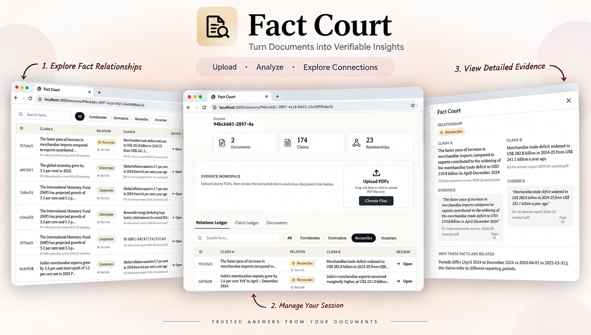

# ⚖️ Fact Court



## Table of Contents

Use this navigation map to jump to the section you need.

| **🧭 Overview**                 | [Approach](#approach) · [Architecture](#architecture) · [Core Principle](#core-principle) · [Technology](#technology)                                                                                                                                                   |
| :------------------------------ | :---------------------------------------------------------------------------------------------------------------------------------------------------------------------------------------------------------------------------------------------------------------------- |
| **🧠 Reasoning & Adjudication** | [Deterministic Reasoning First](#4-deterministic-reasoning-first) · [Semantic Adjudication](#5-semantic-adjudication) · [Example: Evidence-Backed Relationship](#example-evidence-backed-relationship) · [Why These Four Relationships?](#why-these-four-relationships) |
| **⚙️ Processing & Reliability** | [Handling the Open-Ended Parts](#handling-the-open-ended-parts) · [Handling LLM Rate Limits](#handling-llm-rate-limits) · [Incremental Processing](#incremental-processing) · [Failure Handling](#failure-handling)                                                     |
| **🏗️ Design**                  | [Design Tradeoffs](#design-tradeoffs) · [Limitations](#limitations) · [Next Steps](#next-steps)                                                                                                                                                                         |
| **🎥 Demo**                     | [Demo](#demo)                                                                                                                                                                                                                                                           |
| **🚀 Getting Started**          | [Quick Start](#quick-start)                                                                                                                                                                                                                                             |

## Approach

The assignment is intentionally open-ended, so the system was designed around four principles:

**Ground first. Compare second. Use deterministic reasoning where possible. Use the LLM only where semantic judgment is actually needed.**

The pipeline is:

```text
PDFs
  ↓
Page-level extraction
  ↓
Evidence Blocks
  ↓
LLM Claim Extraction
  ↓
Evidence Verification
  ↓
Candidate Matching
  ↓
Deterministic Comparison
  ↓
LLM Adjudication
  ↓
Relationships
```

---

## Architecture

```text
                    ┌─────────────────┐
                    │   Next.js UI    │
                    └────────┬────────┘
                             │
                             ▼
                    ┌─────────────────┐
                    │    FastAPI      │
                    └────────┬────────┘
                             │
                ┌──────────────┴──────────────┐
                ▼                             ▼
        ┌───────────────┐             ┌───────────────┐
        │ PDF Pipeline  │             │    SQLite     │
        │               │             │               │
        │ PyMuPDF       │             │ Documents     │
        │ Evidence      │             │ Evidence      │
        │ Blocks        │             │ Claims        │
        └───────┬───────┘             │ Relationships │
                │                     └───────────────┘
                ▼
        ┌───────────────┐
        │ Gemini        │
        │ Claim         │
        │ Extraction    │
        └───────┬───────┘
                ▼
        ┌───────────────┐
        │ Verification  │
        └───────┬───────┘
                ▼
        ┌───────────────┐
        │ Candidate     │
        │ Matching      │
        └───────┬───────┘
                ▼
        ┌───────────────┐
        │ Deterministic │
        │ Rules         │
        └───────┬───────┘
                │
         ambiguous pairs
                │
                ▼
        ┌───────────────┐
        │ Gemini        │
        │ Adjudication  │
        └───────┬───────┘
                ▼
         Relationship
```

The architecture deliberately avoids unnecessary infrastructure. SQLite is sufficient for the prototype while keeping the complete evidence and relationship graph inspectable.

---

## Handling the Open-Ended Parts

### 1. What is a "fact"?

Instead of defining a fixed list of facts, claims are represented using general attributes:

```text
Subject
Predicate
Value
Unit
Period
Scope
Basis
Definition
Evidence
Confidence
```

This allows the system to work with financial, economic and operational metrics without hard-coding document-specific facts.

---

### 2. How do we know two claims are related?

Comparing every claim against every other claim creates unnecessary `O(n²)` comparisons.

A candidate-matching layer first filters plausible pairs using:

- subject similarity
- predicate similarity
- canonicalized terminology
- token-based Jaccard overlap
- value/type compatibility
- unit compatibility
- period metadata
- definition compatibility

The matcher only proposes candidates.

**It does not decide the final relationship.**

This allows a pair to be a valid candidate even when the final result is `UNCERTAIN`, `RECONCILES`, or `CONTRADICTS`.

---

### 3. Evidence Verification

LLM-generated claims are not automatically trusted.

Each extracted claim contains an evidence quote and the ID of its source evidence block.

The verification layer checks the quote against the extracted PDF text using:

- normalized text matching
- exact substring matching
- fuzzy sequence similarity for small extraction differences

Only verified claims participate in relationship analysis.

Unverified claims are retained so extraction failures remain inspectable rather than silently disappearing.

---

## Example: Evidence-Backed Relationship

The UI exposes both claims, their source passages, and the reasoning behind the verdict.

For example, two merchandise trade-deficit claims can report different values because they cover different reporting periods. Fact Court identifies the context difference and returns `RECONCILES`[...]


*Example output: both claims and their source evidence are shown alongside the `RECONCILES` verdict and `DIFFERENT_PERIOD` reasoning.*

---

### 4. Deterministic Reasoning First

Many comparisons do not require an LLM.

Examples:

```text
₹1,000 million
      =
₹100 crore
      ↓
CORROBORATES
```

or:

```text
FY23
  vs
FY24
  ↓
RECONCILES
```

Deterministic rules handle cases involving:

- unit normalization
- rounding
- reporting periods
- scope differences
- compatible values

This reduces LLM usage while making obvious decisions predictable.

---

### 5. Semantic Adjudication

Some relationships cannot safely be decided with simple rules.

For ambiguous candidates, Gemini receives:

- Claim A
- Claim B
- evidence for both
- period
- scope
- definition
- basis

The model then chooses between:

```text
CORROBORATES
CONTRADICTS
RECONCILES
UNCERTAIN
```

The LLM acts as an **adjudicator for ambiguity**, not as an unrestricted document-comparison engine.

---

## Handling LLM Rate Limits

The prototype uses the Gemini free tier, so request and token limits are a practical constraint.

Instead of trying to work around those limits, the pipeline is designed around them.

### Token-aware batching

Large PDFs are divided into evidence blocks and grouped into batches based on estimated token usage.

```text
Large PDF
   ↓
Evidence blocks
   ↓
token-aware batches
   ↓
multiple controlled requests
```

### Request throttling

A shared rate limiter controls request frequency.

Small manual delays are also used between batches to avoid immediately exhausting the request-per-minute allowance.

### Exponential backoff

Temporary failures such as rate limits or transient provider errors are retried using increasing delays rather than repeatedly retrying immediately.

```text
Request
  ↓
Failure
  ↓
wait
  ↓
retry
  ↓
Failure
  ↓
longer wait
  ↓
retry
```

This makes the pipeline slower, but considerably more reliable under free-tier constraints.

**The tradeoff is intentional: controlled and reliable processing is preferred over maximum throughput.**

---

## Incremental Processing

Documents are grouped into sessions.

A new document only needs to compare its newly extracted claims against claims already present in that session.

```text
PDF 1
 ↓
Claims A

PDF 2
 ↓
Claims B ──────→ A

PDF 3
 ↓
Claims C ──────→ A + B
```

This avoids rebuilding the complete analysis whenever another document is added.

---

## Failure Handling

The system is designed to fail conservatively.

Examples:

```text
Evidence cannot be verified
        ↓
Claim retained
        ↓
Not used for relationships
```

or:

```text
Potential candidate
        ↓
Insufficient semantic context
        ↓
UNCERTAIN
```

The goal is not to produce a relationship for every pair.

The goal is to produce a relationship **only when there is enough evidence to justify it**.

---

## Why These Four Relationships?

The system separates numerical difference from semantic contradiction.

| Relationship | Decision |
|---|---|
| **CORROBORATES** | Same underlying fact and compatible context |
| **CONTRADICTS** | Same fact, same context, materially conflicting |
| **RECONCILES** | Difference explained by period, scope, definition, methodology or estimate vintage |
| **UNCERTAIN** | Insufficient evidence or genuinely different/ambiguous metrics |

---

## Design Tradeoffs

### SQLite over a graph database

A graph database would be possible, but unnecessary for this prototype.

Claims and relationships naturally form a graph conceptually, while SQLite keeps persistence, querying and debugging simple.

### Pairwise matching over full semantic search

The current candidate matcher is intentionally lightweight.

It reduces the search space without introducing another infrastructure dependency.

Semantic retrieval/embeddings would be a natural next step for much larger collections.

### LLM extraction over hand-written parsers

Documents vary too much to reliably maintain document-specific extraction rules.

Structured LLM extraction provides a more general approach while evidence verification provides a quality gate.

### Rules + LLM over LLM-only reasoning

Using an LLM for every comparison would be slower, less predictable and unnecessarily expensive.

The hybrid approach keeps deterministic cases deterministic and reserves semantic reasoning for ambiguous cases.

---

## Demo

The demo demonstrates:

1. **CORROBORATES** — same underlying fact expressed differently
2. **CONTRADICTS** — same metric and context with conflicting values
3. **RECONCILES** — different values explained by context
4. **UNCERTAIN / FAILURE** — insufficient evidence or an extraction/reasoning failure

Each result exposes the claims and source evidence used to reach the verdict.

**Video:** [Watch the Demo](https://drive.google.com/drive/folders/1jzx0fR84Qzik5VOVIhziLzRByvzs3Wt5)

---

## Limitations

- Gemini's free tier introduces request/token limits, so large documents can take longer to process.
- PDF extraction can struggle with complex layouts and tables.
- Text-based evidence verification cannot fully capture visual context.
- Conservative candidate matching can miss loosely related claims.
- LLM adjudication remains probabilistic for ambiguous cases.
- Pairwise comparison becomes expensive as the claim collection grows.
- Scanned PDFs currently require OCR support.

---

## Next Steps

- OCR for scanned documents
- Semantic retrieval/embeddings for candidate matching
- Better entity resolution
- Human review workflow for uncertain claims
- Improved table/layout extraction
- Scalable background workers and production storage
- Automated evaluation benchmarks

---

## Technology

- **Frontend:** Next.js, TypeScript, Tailwind
- **Backend:** Python, FastAPI
- **PDF extraction:** PyMuPDF
- **LLM:** Google Gemini
- **Database:** SQLite
- **Validation:** Pydantic

---

## Quick Start

### Backend

```bash
cd Backendzip
python -m venv venv
```

**Windows:**

```powershell
venv\Scripts\activate
```

**macOS / Linux:**

```bash
source venv/bin/activate
```

```bash
pip install -r requirements.txt
```

Create `.env`:

```env
GEMINI_API_KEY=your_api_key_here
```

Run:

```bash
uvicorn main:app --reload
```

API docs:

`http://localhost:8000/docs`

### Frontend

```bash
cd fact-court-ledger
npm install
```

Create a `.env.local` file in the `fact-court-ledger` folder.

You can use the provided `.env.example` as a reference:

```env
NEXT_PUBLIC_API_URL=http://localhost:8000
```

Copy this value into your `.env.local` file:

```env
NEXT_PUBLIC_API_URL=http://localhost:8000
```

Then run:

```bash
npm run dev
```

Open:

`http://localhost:3000`


---

## Core Principle

> **Extract → Ground → Compare → Explain**

The system is intentionally small and inspectable: deterministic where possible, LLM-assisted where necessary, and evidence-backed throughout.
